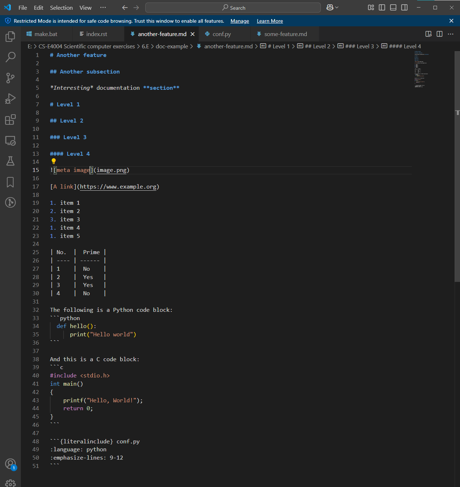

# Another feature

## Another subsection

*Interesting* documentation **section**

# Level 1

## Level 2

### Level 3

#### Level 4



[A link](https://www.example.org)

1. item 1
2. item 2
3. item 3
1. item 4
1. item 5

| No.  |  Prime |
| ---- | ------ |
| 1    |  No    |
| 2    |  Yes   |
| 3    |  Yes   |
| 4    |  No    |

The following is a Python code block:
```python
  def hello():
      print("Hello world")
```

And this is a C code block:
```c
#include <stdio.h>
int main()
{
    printf("Hello, World!");
    return 0;
}
```

```{literalinclude} conf.py
:language: python
:emphasize-lines: 9-12
```